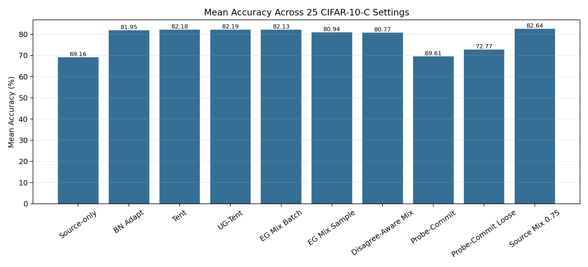
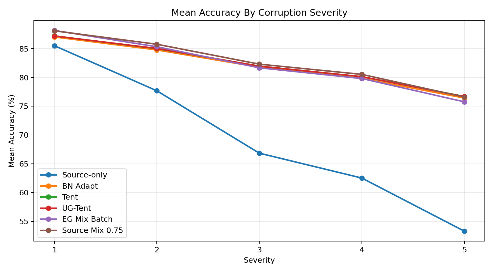
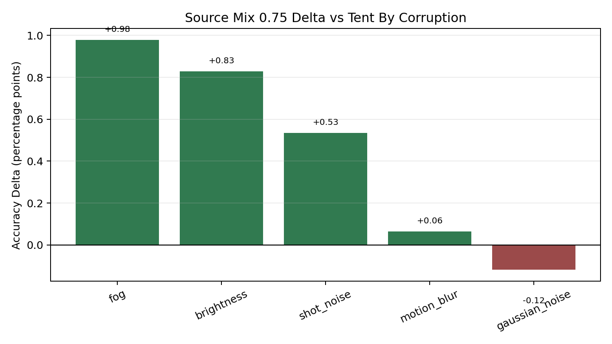
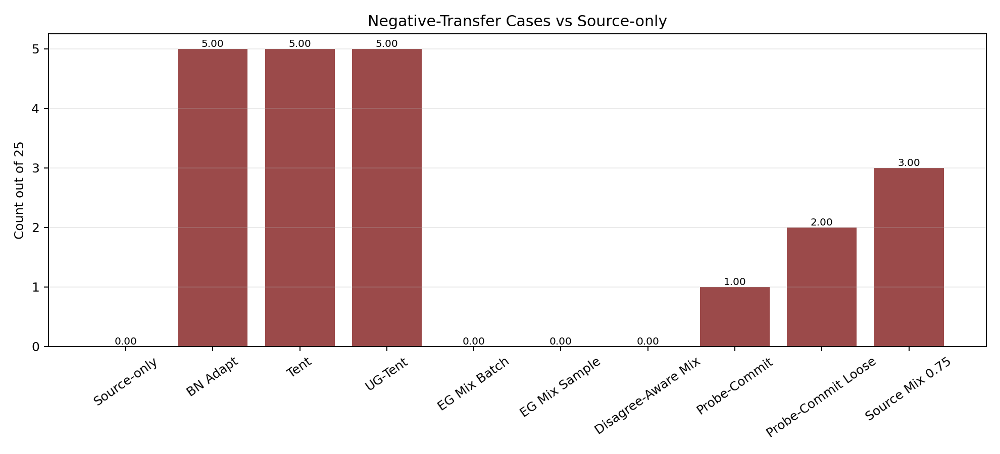

# Source-Preserved Test-Time Adaptation Under Corruption Shift

I built this as a small, reproducible computer-vision study around a practical question:

> When test-time adaptation helps under severe image corruption but hurts under mild shifts, can I preserve useful source-model behavior without losing the gains from adaptation?

The short answer from my experiments: **yes, partially**. A simple source-preserved Tent prediction rule, using **75% adapted logits and 25% frozen source logits**, improved mean accuracy over Tent on the first-pass CIFAR-10-C benchmark and reduced negative-transfer cases.

This is not a state-of-the-art claim. I used this project to understand test-time adaptation, reproduce core baselines, analyze failure cases, and test small stabilization ideas under corruption shift.

## Why I Did This

I am interested in robust visual recognition under distribution shift: models trained on clean data often fail when deployed on noisy, blurry, low-contrast, foggy, or otherwise degraded images. That setting is closely related to test-time adaptation and the kind of deployment-aware robustness questions studied in modern computer vision labs.

I started with Tent because it is a clean baseline for fully test-time adaptation: it adapts a trained model using unlabeled target data by minimizing prediction entropy. In the first run, Tent worked well under severe noise and blur, but it also damaged performance on mild brightness and fog shifts. That failure mode became the center of the project.

## Experimental Setup

**Source dataset:** CIFAR-10 train split  
**Target benchmark:** CIFAR-10-C  
**Model:** CIFAR-adapted ResNet-18  
**Adaptation:** unlabeled test-time adaptation on corrupted target batches  
**First-pass corruptions:** gaussian noise, shot noise, motion blur, brightness, fog  
**Severities:** 1 to 5  
**Total settings:** 25 corruption/severity pairs

**Runtime used:** Google Colab GPU runtime  
**Clean CIFAR-10 source accuracy:** 91.01%  

The source model is trained on clean CIFAR-10. During adaptation, no CIFAR-10-C labels are used for updates; labels are used only for evaluation.

## Methods Compared

| Method | What It Does |
|---|---|
| Source-only | Evaluates the clean-source model directly on CIFAR-10-C. |
| BN Adapt | Uses target batch statistics in BatchNorm without gradient updates. |
| Tent | Minimizes entropy on target batches and updates BatchNorm affine parameters. |
| UG-Tent | Tent with confidence-gated updates. |
| Margin Tent | Tent with top-1/top-2 probability-margin gating. |
| Anchor Tent | Tent with a KL penalty toward frozen source-model predictions. |
| Source Mix Tent | Adapts with Tent, then predicts using a source/adapted logit mixture. |
| Entropy-Gap Mix | Chooses the source/adapted mix using source-vs-adapted entropy gap. |
| Disagreement-Aware Mix | Uses entropy-gap mixing mainly when source and adapted predictions disagree. |
| Probe-Commit Tent | Makes a tentative Tent update and rolls it back if unlabeled safety checks fail. |

The most useful method in this study was:

```text
source_mix_tent_075 = 0.75 * adapted_logits + 0.25 * frozen_source_logits
```

## Results Summary

The final result files are in [`results/`](results/):

- [`adaptive_results.csv`](results/adaptive_results.csv)
- [`variant_summary.csv`](results/variant_summary.csv)
- [`variant_by_severity.csv`](results/variant_by_severity.csv)
- [`negative_transfer_cases.csv`](results/negative_transfer_cases.csv)

Generate final plots with:

```bash
python scripts/make_final_plots.py \
  --results results/adaptive_results.csv \
  --summary results/variant_summary.csv \
  --by-severity results/variant_by_severity.csv \
  --out-dir results/figures
```

This produces:

- `mean_accuracy_by_method.png`
- `accuracy_by_severity.png`
- `source_mix_delta_vs_tent_by_corruption.png`
- `negative_transfer_cases_by_method.png`

### Figures









### Overall Accuracy

| Method | Mean Accuracy | Delta vs Source | Delta vs Tent | Negative-Transfer Cases |
|---|---:|---:|---:|---:|
| Source-only | 69.16% | 0.00 pp | -13.02 pp | 0 |
| BN Adapt | 81.95% | +12.79 pp | -0.23 pp | 5 |
| Tent | 82.18% | +13.02 pp | 0.00 pp | 5 |
| UG-Tent | 82.19% | +13.02 pp | +0.00 pp | 5 |
| Entropy-Gap Mix Batch | 82.13% | +12.97 pp | -0.05 pp | 0 |
| Probe-Commit Tent Loose | 72.77% | +3.60 pp | -9.42 pp | 2 |
| **Source Mix Tent 0.75** | **82.64%** | **+13.48 pp** | **+0.46 pp** | **3** |

Tent already gives a large improvement over source-only. The useful result is that `source_mix_tent_075` improves Tent by **0.46 percentage points** on mean accuracy and reduces negative-transfer cases from **5 to 3**.

## What Changed Across Runs

### Run 1: Core Baselines

The first run compared source-only, BN Adapt, Tent, and UG-Tent.

Main result:

```text
Source-only: 69.16%
BN Adapt:    81.95%
Tent:        82.18%
UG-Tent:     82.19%
```

This showed that normalization-based TTA was doing most of the work. Tent was slightly better than BN Adapt, while confidence-gated UG-Tent was essentially tied with Tent. The important failure case was negative transfer: brightness severity 1-4 and fog severity 1 were better without adaptation.

### Run 2: Extended Ablation

The second run added stricter confidence gates, margin gates, source anchoring, and source/adapted logit mixtures.

This was the strongest run because it found the best-performing method:

```text
source_mix_tent_075: 82.64%
Tent:                82.18%
```

The 50/50 source mix had zero negative-transfer cases but under-adapted on severe corruptions. The 75/25 adapted-source mix was the better tradeoff: it kept most of Tent's severe-shift gains while reducing damage on mild shifts.

### Run 3: Adaptive and Probe-Commit Variants

The third run tested whether I could beat the fixed 75/25 mix using adaptive rules.

Main result:

```text
source_mix_tent_075: 82.64%
entropy-gap batch:   82.13%
entropy-gap sample:  80.94%
probe-commit loose:  72.77%
```

The adaptive methods were useful diagnostically, but they did not beat the fixed mix. Entropy-gap batch mixing eliminated negative-transfer cases, but lost too much accuracy under severe noise. Probe-commit was too conservative; it rejected too many updates and behaved closer to source-only.

So yes: **the best method came from the second run, and the third run confirmed that it remained the best overall.**

## Corruption-Level Behavior

Compared to Tent, `source_mix_tent_075` improved:

| Corruption | Mean Delta vs Tent |
|---|---:|
| Fog | +0.98 pp |
| Brightness | +0.83 pp |
| Shot Noise | +0.53 pp |
| Motion Blur | +0.06 pp |
| Gaussian Noise | -0.12 pp |

This explains the tradeoff clearly. The source-preserved mix helps when the source model is still reliable, especially brightness and fog. It can slightly hurt under severe gaussian noise, where the source model has already collapsed and the adapted model should be trusted more.

## Best Method By Setting

Across the 25 corruption/severity settings, the winner was:

| Method | Number of Wins |
|---|---:|
| Source Mix Tent 0.75 | 9 |
| Entropy-Gap Mix Sample | 5 |
| Tent | 4 |
| Entropy-Gap Mix Batch | 3 |
| Disagreement-Aware Mix | 2 |
| UG-Tent | 2 |

The oracle best method across all settings would average **82.92%**, compared to **82.18%** for Tent and **82.64%** for Source Mix Tent 0.75. That gap suggests there is still room for a better adaptive policy, but my current adaptive policies were not strong enough.

## What I Learned

1. **BN adaptation is a very strong baseline.**  
   It recovered most of the lost accuracy under noise and blur before any entropy-minimization update was added.

2. **Tent is strong but not always safe.**  
   It improved severe corruption performance, but caused negative transfer when the source model was already good.

3. **Confidence gating alone was not enough.**  
   UG-Tent selected fewer samples, but accuracy barely changed. The gate reduced updates without meaningfully changing behavior.

4. **Source preservation helped.**  
   A small amount of frozen source signal improved the safety/accuracy tradeoff.

5. **Over-conservative safeguards can fail.**  
   Probe-commit looked attractive conceptually, but it committed too few updates and under-adapted badly on severe corruption.

## How To Reproduce

Install dependencies:

```bash
pip install -r requirements.txt
```

Run the core benchmark:

```bash
python scripts/run_study.py \
  --config configs/default.yaml \
  --data-root data \
  --epochs 15 \
  --results results/core_results.csv \
  --variant-suite core
```

Run the final adaptive suite:

```bash
python scripts/run_study.py \
  --config configs/default.yaml \
  --data-root data \
  --epochs 15 \
  --results results/adaptive_results.csv \
  --variant-suite adaptive
```

Analyze results:

```bash
python scripts/analyze_variants.py --results results/adaptive_results.csv
```

For Colab, I used Google Drive for the CIFAR-10-C archive and model checkpoint. See [`COLAB_GUIDE.md`](COLAB_GUIDE.md) for the full setup.

## Claim Boundaries

I would describe this project as:

> A small CIFAR-10-C test-time adaptation study comparing source-only inference, BN adaptation, Tent, and source-preserved Tent variants across 25 corruption/severity settings, with analysis of negative transfer under mild shifts.

I would not describe it as:

- state-of-the-art
- a full SANTA or pSTarC reproduction
- a new general-purpose TTA method
- ImageNet-scale validation
- proof that source mixing always improves TTA

## References

- Wang et al., **Tent: Fully Test-Time Adaptation by Entropy Minimization**, ICLR 2021.
- Hendrycks and Dietterich, **Benchmarking Neural Network Robustness to Common Corruptions and Perturbations**, ICLR 2019.
- Chakrabarty, Sreenivas, and Biswas, **SANTA: Source Anchoring Network and Target Alignment for Continual Test Time Adaptation**, TMLR 2023.
- Sreenivas et al., **pSTarC: Pseudo Source Guided Target Clustering for Fully Test-Time Adaptation**, WACV 2024.
